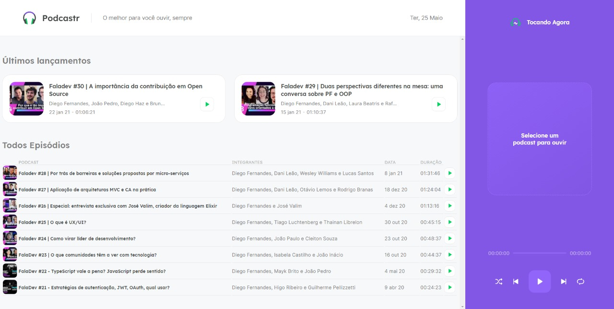

# Podcastr
## :book: About
Project created at Next Level Week 5, organized by Rocket Seat. The application consists basically in a podcast player, which the user can play/pause, 
go to previous/next podcast and play either on repeat or shuffle mode.

## :rocket: Main technologies:
* [NextJS](https://nextjs.org/)
* [SCSS](https://sass-lang.com/)
* [TypeScript](https://www.typescriptlang.org/)
* [Context API](https://pt-br.reactjs.org/docs/context.html)

## :computer: Layout


## :electric_plug: Running the project
To run the project you must have installed on your computer the following technologies:
* [NodeJS](https://nodejs.org/en/)
* [Yarn](https://yarnpkg.com/)
* [Git](https://git-scm.com)

```bash
  # Clone the repository.
  $ git clone https://github.com/phb2000/NLW05_React.git
  
  # Go to the project folder using cmd
  $ cd NLW05_React
  
  # Install the dependecies using the following command:
  $ yarn install
  
  # Start the server
  $ yarn server
  
  # Start the application
  $ yarn dev
```

Now you can access [localhost](http://localhost:3000/) and use the project.
